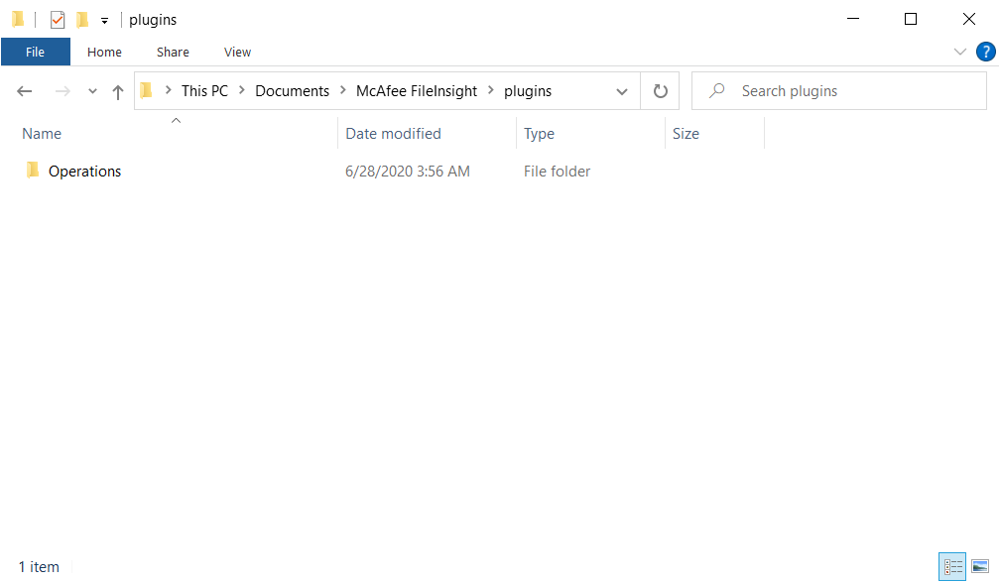

# How to install
## Automatic installation
Please execute the following command. FileInsight-plugins and all pre-requisites including FileInsight will be installed.

```
powershell -exec bypass -command "IEX((New-Object Net.WebClient).DownloadString('https://raw.githubusercontent.com/nmantani/FileInsight-plugins/master/install.ps1'))"
```

If you use a HTTP proxy, please download install.ps1 and edit $PROXY_HOST and $PROXY_PORT variables in it,
then please execute the following command.

```
powershell -exec bypass .\install.ps1
```

## Manual installation
**I strongly recommend automatic installation** because manual installation requires many steps.

### **Installation of FileInsight**
FileInsight installer is available at the McAfee Free Tools website.
Please get it from https://www.mcafee.com/enterprise/en-us/downloads/free-tools/fileInsight.html .

### **Installation of Python 3**
FileInsight-plugins requires Python 3 since version 2.0 (older versions require Python 2 (x86)), though the built-in Python interpreter of FileInsight is Python 2. You no longer need to install Python 2 (x86) with the latest version (3.5) of FileInsight. Please get Python 3 installer from https://www.python.org/downloads/windows/ .

### **Installation of FileInsight-plugins**
Please copy "plugins" folder into %USERPROFILE%\Documents\McAfee FileInsight .



### **Pre-requisites**
For the "aPLib compress" and "aPLib decompress" plugins, they require aplib.dll.
Please download aPLib from http://ibsensoftware.com/download.html and copy
aplib.dll (32 bits version) into "plugins\Operations\Compression" folder.

For the "Binwalk scan" plugin, it requires binwalk Python module.
Please get it from https://github.com/ReFirmLabs/binwalk
(pip cannot be used to install binwalk)."

For crypto-related plugins such as "AES decrypt", it requires PyCryptodome Python module.
Please get it from https://github.com/Legrandin/pycryptodome
or execute the following command.
```
py.exe -3 -m pip install pycryptodomex
```

For the "File type" plugin, it requires python-magic Python module.
Please get it from https://github.com/ahupp/python-magic
or execute the following command.
```
py.exe -3 -m pip install python-magic-bin
```

For the "Find PE" file plugin, it requires pefile Python module.
Please get it from https://github.com/erocarrera/pefile
or execute the following command.
```
py.exe -3 -m pip install pefile
```

For the "YARA scan" plugin, it requires yara-python Python module.
Please get it from https://github.com/VirusTotal/yara-python
or execute the following command.
```
py.exe -3 -m pip install yara-python
```

For the "Emulate code" plugin, it requires Qiling Framework and watchdog Python module.
Please get it from https://github.com/qilingframework/qiling/ and
https://github.com/gorakhargosh/watchdog .
or execute the following commands.
```
py.exe -3 -m pip install qiling
py.exe -3 -m pip install watchdog
```

You also need to set up rootfs files of Qiling Framework.
Please download them from https://github.com/qilingframework/qiling/archive/master.zip and copy extracted "qiling-master" folder into "plugins\Operations\Misc" folder.

Then please setup DLL files and registry files of rootfs with the following commands on PowerShell:
```powershell
$dest_dir = [Environment]::GetFolderPath('Personal') + "\McAfee FileInsight\plugins\Operations\Misc"

Start-Process powershell -Verb RunAs -Wait -ArgumentList "-Command `"cd '${dest_dir}\qiling-master'; examples\scripts\dllscollector.bat`""
```

For the "Disassemble" plugin, it requires Capstone.
Please get it from https://github.com/aquynh/capstone/
or execute the following command.
```
py.exe -3 -m pip install capstone
```

For the "Hash values" plugin, it requires pyimpfuzzy-windows.
Please get it from https://github.com/JPCERTCC/impfuzzy/
or execute the following command.
```
py.exe -3 -m pip install pyimpfuzzy-windows
```

For the "LZ4 compress" and "LZ4 decompress" plugins, it requires python-lz4.
Please get it from https://github.com/python-lz4/python-lz4/
or execute the following command.
```
py.exe -3 -m pip install lz4
```

For the "Zstandard compress" and "Zstandard decompress" plugins, it requires python-zstandard.
Please get it from https://github.com/indygreg/python-zstandard/
or execute the following command.
```
py.exe -3 -m pip install zstandard
```

For the "Protobuf decode" plugin, it requires blackboxprotobuf (forked version).
Please get it from https://github.com/ydkhatri/blackboxprotobuf/
or execute the following command.
```
py.exe -3 -m pip install blackboxprotobuf
```

You can install some of required Python modules with the following command.
```
py.exe -3 -m pip install -r requirements.txt
```

For the "Show metadata" plugin, it requires ExifTool.
Please download ExifTool from https://exiftool.org/
and copy exiftool(-k).exe as exiftool.exe into "plugins\Operations\Parsing" folder.
