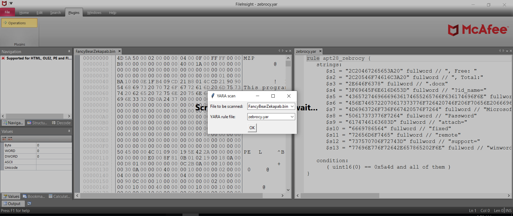
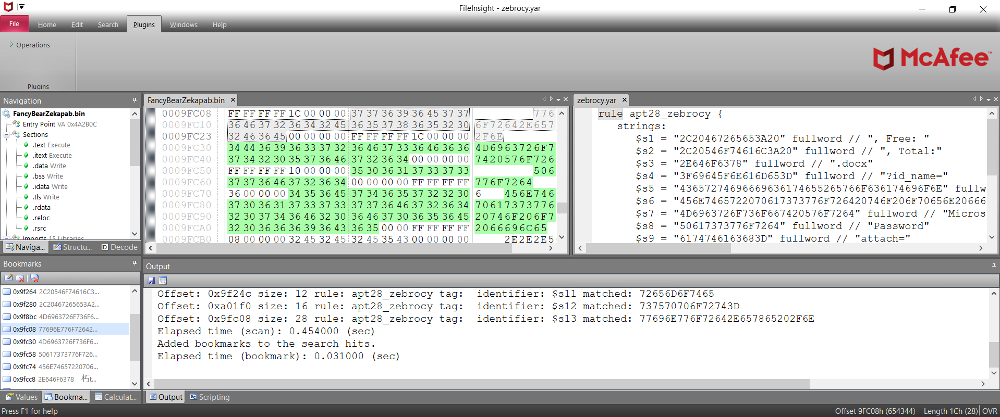
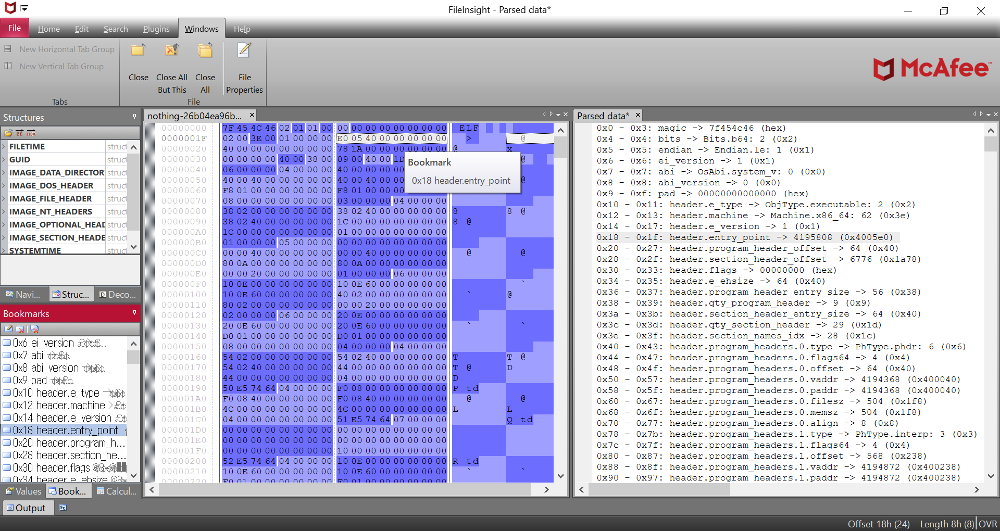
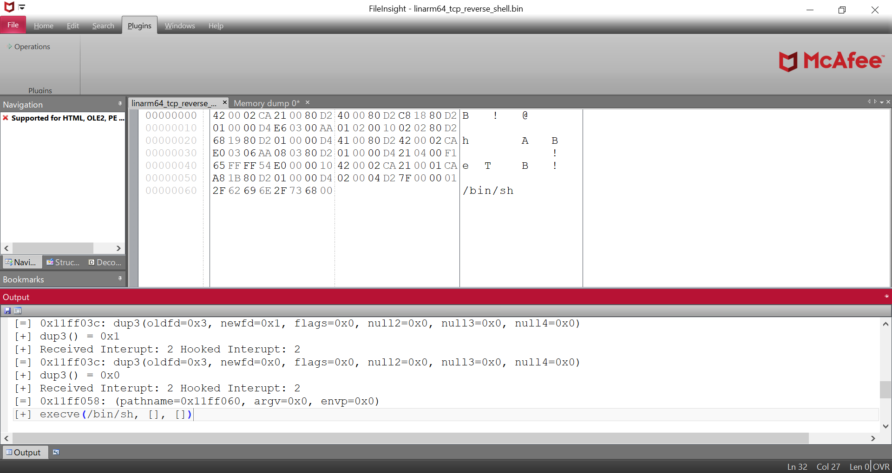
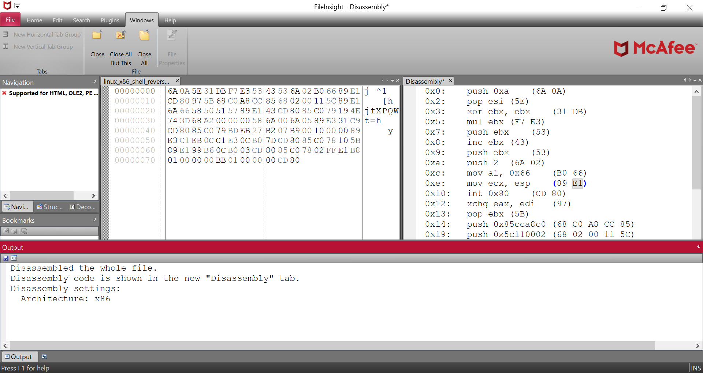
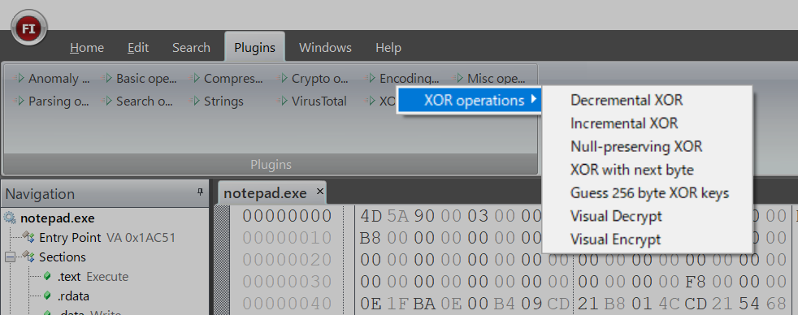
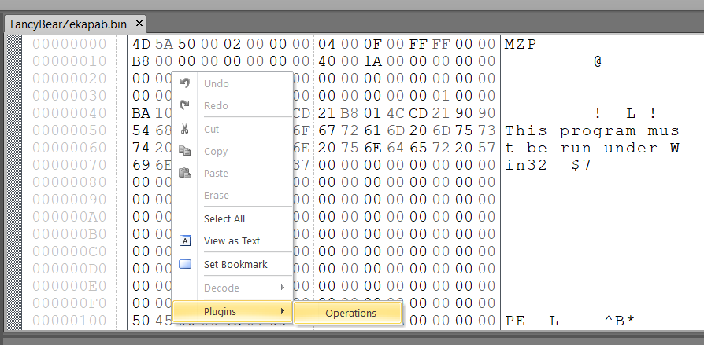
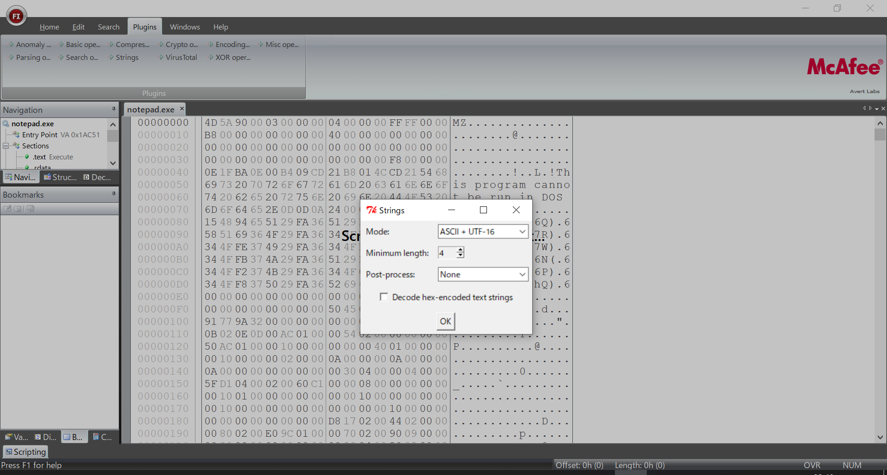

# FileInsight-plugins: a decoding toolbox of McAfee FileInsight hex editor for malware analysis

FileInsight-plugins is a collection of plugins for McAfee FileInsight hex editor.
It adds many capabilities such as decryption, decompression, searching XOR-ed text strings, scanning with a YARA rule, code emulation, disassembly, and more!
It is useful for various kind of decoding tasks in malware analysis (e.g. extracing malware executables and decoy documents from malicious document files).

## Screenshots










## How to install
### Automatic installation
Please execute the following command. FileInsight-plugins and all pre-requisites including FileInsight and Python 3 will be installed.

```
powershell -exec bypass -command "IEX((New-Object Net.WebClient).DownloadString('https://raw.githubusercontent.com/nmantani/FileInsight-plugins/master/install.ps1'))"
```

If you use a HTTP proxy, please download [install.ps1](https://raw.githubusercontent.com/nmantani/FileInsight-plugins/master/install.ps1) and edit $PROXY_HOST and $PROXY_PORT variables in it,
then please execute the following command.

```
powershell -exec bypass .\install.ps1
```

### Manual installation
Please read [INSTALL.md](INSTALL.md) for details.
**I strongly recommend automatic installation** because manual installation requires many steps.

## How to use
Please click a category from the "Plugins" tab then select a plugin.



You can also use plugins from the right-click menu.



Some plugins show an additional dialog for plugin settings at use of them.



## How to update
### Semi-automatic update
If you would like to update FileInsight-plugins to the latest release version,
please execute the following command. Existing files will be overwritten.

```
powershell -exec bypass -command "& ([scriptblock]::Create((New-Object Net.WebClient).DownloadString('https://raw.githubusercontent.com/nmantani/FileInsight-plugins/master/install.ps1'))) -update"
```

If you use a HTTP proxy, please download install.ps1 and edit $PROXY_HOST
and $PROXY_PORT variables in it, then please execute the following command.

```
powershell -exec bypass .\install.ps1 -update
```

### Manual update
Please download the latest release version and copy "plugins" folder into
%USERPROFILE%\Documents\McAfee FileInsight to overwrite with the new version.

## Customization
For the "Send to" plugin, please edit "plugins\Operations\Misc\send_to.json" to run your
favorite programs.

## List of plugins (80 plugins)
* Basic operations
  * Copy to new file  
    Copy selected region (the whole file if not selected) to new file
  * Cut binary to clipboard  
    Cut binary data of selected region to clipboard as hex-encoded text
  * Copy binary to clipboard  
    Copy binary data of selected region to clipboard as hex-encoded text
  * Paste binary from clipboard  
    Paste binary data (converted from hex-encoded text) from clipboard
  * Delete before  
    Delete all region before current cursor position
  * Delete after  
    Delete all region after current cursor position
  * Fill  
    Fill selected region with specified hex pattern
  * Invert  
    Invert bits of selected region
  * Reverse order  
    Reverse order of selected region
  * Swap nibbles  
    Swap each pair of nibbles of selected region
  * Swap two bytes  
    Swap each pair of bytes of selected region
  * To upper case  
    Convert text to upper case of selected region
  * To lower case  
    Convert text to lower case of selected region
  * Swap case  
    Swap case of selected region

* Compression operations
  * aPLib compress  
    Compress selected region with aPLib compression library
  * aPLib decompress  
    Decompress selected region with aPLib compression library
  * Bzip2 compress  
    Compress selected region with bzip2 algorithm
  * Bzip2 decompress  
    Decompress selected region with bzip2 algorithm
  * Gzip compress  
    Compress selected region with gzip format
  * Gzip decompress  
    Decompress selected gzip compressed region
  * LZMA compress  
    Compress selected region with LZMA algorithm
  * LZMA decompress  
    Decompress selected region with LZMA algorithm
  * LZNT1 compress  
    Compress selected region with LZNT1 algorithm
  * LZNT1 decompress  
    Decompress selected region with LZNT1 algorithm
  * Raw deflate  
    Compress selected region with Deflate algorithm without header and checksum (Equivalent to gzdeflate() in PHP language)
  * Raw inflate  
    Decompress selected Deflate compressed region that does not have header and checksum (Equivalent to gzinflate() in PHP language)
  * XZ compress  
    Compress selected region with XZ format
  * XZ decompress  
    Decompress selected XZ compressed region

* Crypto operations
  * AES decrypt  
    Decrypt selected region with AES
  * AES encrypt  
    Encrypt selected region with AES
  * ARC2 decrypt  
    Decrypt selected region with ARC2 (Alleged RC2)
  * ARC2 encrypt  
    Encrypt selected region with ARC2 (Alleged RC2)
  * ARC4 decrypt / encrypt  
    Decrypt / encrypt selected region with ARC4 (Alleged RC4)
  * Blowfish decrypt  
    Decrypt selected region with Blowfish
  * Blowfish encrypt  
    Encrypt selected region with Blowfish
  * ChaCha20 decrypt / encrypt  
    Decrypt / encrypt selected region with ChaCha20
  * DES decrypt  
    Decrypt selected region with DES
  * DES encrypt  
    Encrypt selected region with DES
  * Salsa20 decrypt / encrypt  
    Decrypt / encrypt selected region with Salsa20
  * Triple DES decrypt  
    Decrypt selected region with Triple DES
  * Triple DES encrypt  
    Encrypt selected region with Triple DES

* Encoding operations
  * Binary data to hex text  
    Convert binary of selected region into hex text
  * Hex text to binary data  
    Convert hex text of selected region into binary
  * Binary data to decimal text  
    Convert binary of selected region into decimal text
  * Decimal text to binary data  
    Convert decimal text of selected region into binary data
  * Binary data to octal text  
    Convert binary of selected region into octal text
  * Octal text to binary data  
    Convert octal text of selected region into binary data
  * Binary data to binary text  
    Convert binary of selected region into binary text
  * Binary text to binary data  
    Convert binary text of selected region into binary data
  * Custom base64 decode  
    Decode selected region with custom base64 table
  * Custom base64 encode  
    Encode selected region with custom base64 table
  * ROT13  
    Rotate alphabet characters in selected region by the specified amount (default: 13)
  * From quoted printable  
    Decode selected region as quoted printable text
  * To quoted printable  
    Encode selected region into quoted printable text
  * URL decode  
    Decode selected region as percent-encoded text that is used by URL
  * URL encode  
    Encode selected region into percent-encoded text that is used by URL

* Misc operations
  * Byte frequency  
    Show byte frequency of selected region (the whole file if not selected)
  * Emulate code  
    Emulate selected region as an executable or shellcode with Qiling Framework (the whole file if not selected)
  * File comparison  
    Compare contents of two files
  * Hash values  
    Calculate MD5, SHA1, SHA256, ssdeep, imphash, impfuzzy hash values of selected region (the whole file if not selected)
  * Send to  
    Send selected region (the whole file if not selected) to other programs

* Parsing operations
  * Binwalk scan  
    Scan selected region (the whole file if not selected) to find embedded files
  * Disassemble  
    Disassemble selected region (the whole file if not selected)
  * File type  
    Identify file type of selected region (the whole file if not selected)
  * Find PE file  
    Find PE file from selected region (the whole file if not selected)
  * Parse file structure  
    Parse file structure of selected region (the whole file if not selected) with Kaitai Struct
  * Show metadata  
    Show metadata of selected region (the whole file if not selected) with ExifTool
  * Strings  
    Extract text strings from selected region (the whole file if not selected)

* Search operations
  * Regex search  
    Search with regular expression in selected region (the whole file if not selected)
  * Replace  
    Replace matched data in selected region (the whole file if not selected) with specified data
  * XOR hex search  
    Search XORed / bit-rotated data in selected region (the whole file if not selected)
  * XOR text search  
    Search XORed / bit-rotated string in selected region (the whole file if not selected)
  * YARA scan  
    Scan selected region (the whole file if not selected) with YARA.

* XOR operations
  * Decremental XOR  
    XOR selected region while decrementing XOR key
  * Incremental XOR  
    XOR selected region while incrementing XOR key
  * Null-preserving XOR  
    XOR selected region while skipping null bytes and XOR key itself
  * XOR with next byte  
    XOR selected region while using next byte as XOR key
  * Guess 256 byte XOR keys  
    Guess 256 byte XOR keys from selected region (the whole file if not selected) based on the byte frequency
  * Visual encrypt  
    Encode selected region with visual encrypt algorithm that is used by Zeus trojan
  * Visual decrypt  
    Decode selected region with visual decrypt algorithm that is used by Zeus trojan

## Author
Nobutaka Mantani (Twitter: @nmantani)

## License
The BSD 2-Clause License (http://opensource.org/licenses/bsd-license.php)
